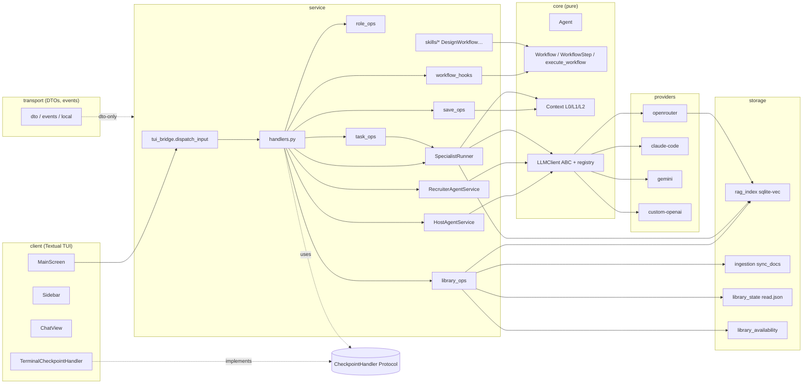
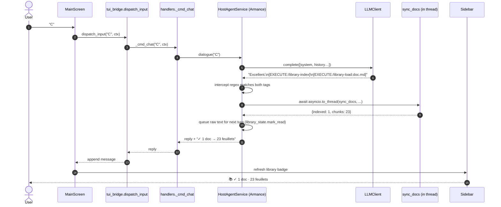
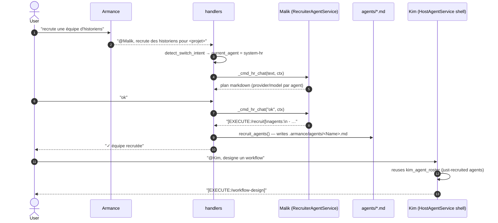

# Architecture

## Layering

```
┌──────────────────────────────────────────────────────────────┐
│ client      Textual TUI (and the future web client)          │
│             rendering, user input, no business logic         │
├──────────────────────────────────────────────────────────────┤
│ transport   DTOs + event bus                                 │
│             wire format only; protocol-agnostic              │
├──────────────────────────────────────────────────────────────┤
│ service     orchestration, agents, workflows, RAG plumbing   │
│             stateful, async. Public entry: dispatch_input    │
├──────────────────────────────────────────────────────────────┤
│ core        pure models + protocols (LLM client, storage)    │
│             no I/O                                           │
└──────────────────────────────────────────────────────────────┘
```

Rule: **lower layers know nothing of upper layers**. The lint for this is
the import graph (`grep -rn "from armance.client" src/armance/{core,service}`
must return zero matches).

## Module map (`src/armance/`)

```
cli.py              Entrypoints: init / run / index / doctor / workflow / web
config.py           Config + ProviderConfig, ensure_armance_tree, builtin
                    agents install, language
core/
  models/             Agent, Task, Workflow, Context (L0/L1/L2),
                      Claim, Deliverable, Conversation, Turn, Tokens
  protocols/          LLM + Notifier ABCs
providers/
  openrouter.py       OpenAI-compatible httpx client + reasoning support
  claude_code.py      claude-agent-sdk adapter
  gemini.py           Google REST client
  custom_openai.py    BYO OpenAI-compatible endpoint
  model_discovery.py  Live OpenRouter model categorisation by cost tier
service/
  handlers.py         Slash-command dispatchers + chat routing
                      (library / save / role groups moved out — see
                      *_ops.py below. Chat shells split queued.)
  library_ops.py      /library + intercept_library_status
  save_ops.py         /save L0/L1/L2 dispatch
  role_ops.py         /role, /agents, /agent, /feedback-loop, /iterate-from
  workflow_hooks.py   cross-family validation + Serge consensus auto-invoke
                      (called by core.execute_workflow via pre/post hooks)
  skills/             design_workflow, feedback_loop, iterate_from,
                      set_l0/l1/l2
  agents/
    host_agent.py       Armance (and reused for Kim + Malik chat shells)
    recruiter_agent.py  Malik
    judge_agent.py      Mona
    challenger_agent.py Serge
    specialist_runner.py Per-specialist run with L0+L1+L2+RAG
    _rag_inject.py      Meta-agent RAG injection helper
    _voice_overlay.py   Language-overlay block appended to every prompt
    lifecycle / edit / promote / demote / archive / replace skills
  context_service.py  L0/L1/L2 read+write, manifest, RAG enrichment
  cost.py             Pre-flight workflow cost estimation
  session.py          Session state, ledger, conversation persistence
  llm_service.py      LLMClient factory + TokenLedger + continuation
                      handler for finish_reason=length
  rag_service.py      Re-export shim (RagService lives in storage)
  rerank.py           Two-stage retrieval hook: builds the async
                      rerank(query, chunks) callable injected into
                      context_with_rag (recall candidate_k=20 →
                      cross-encoder keep_n=5; failures degrade
                      silently to vector order)
  checkpoint.py       Human-in-the-loop checkpoint contract
storage/
  rag_index.py        RagService (sqlite-vec) + context_with_rag helper
  ingestion.py        sync_docs (md / pdf / docx / txt → chunks +
                      per_doc_chunks reporting)
  library_state.py    Persistent 'read' set + per-session mirror
  rag_status.py       Library status report (indexed/orphans/chunks)
  paths.py            Canonical file paths in .armance/
  conversation_store.py Markdown conversation log
  filesystem.py       Atomic writes, lockfiles
transport/
  dto.py              Public DTOs (Conversation, Workflow, Step, Event)
  events.py           Event types
  local.py            In-process event bus
client/
  tui/                Textual app — chat, sidebar, claims, workflow view
    nls.py + nls/     i18n stub (EN today; per-language YAMLs next)
templates/
  pdf_default.css     WeasyPrint stylesheet
protocols/            Caveman protocol prompts (ultra/lite/full)
```

## Data layout (`.armance/`)

```
docs/               user-dropped documents (PDF, DOCX, MD, TXT)
vector/             sqlite-vec index + manifest.json (indexed docs) +
                    read.json (persistently loaded docs)
agents/
  system-*.md         five built-in staff agents
  <Name>.md           Malik-recruited specialists
  builtin/            seed copies, used by ensure_armance_tree
workflows/          *.yaml DAGs (user-created via Kim; no default ships)
exports/<wf>/       versioned runs — run-<ts>/{step-*.md, synthesis.md,
                    manifest.json} + runs.json index. Never overwritten.
context/            L0_v<N>.md / L1_<role>_v<N>.md / L2_<theme>_v<N>.md
                    + manifest.json
reports/            <agent>_v<N>.md per step
sessions/<id>/      state.json, ledger.json, conversation.md
exports/            generated deliverables (.pptx / .docx / .pdf / .md)
config.yaml         non-secret config
.env                provider API keys (gitignored)
```

## Provider matrix

| Provider | Reasoning | Default model | Notes |
|---|---|---|---|
| `openrouter` | Yes (`reasoning` field) | `openai/gpt-oss-120b:free` | Most free `:free` models live here |
| `claude-code` | No | `claude-opus-4-5` | Optional extra |
| `gemini` | No | `gemini-2.0-flash` | |
| `custom-openai` | Model-dependent | your choice | Any OpenAI-compatible endpoint |

## Agent system prompt assembly

```
effective_system_prompt =
    caveman_protocol_overlay      (optional, "ultra" / "lite" / "full" / "none")
  + agent_body                    (the YAML-fronted markdown file)
  + voice_overlay(language)       (short directive — Phase D)
  + RAG injection                 (top-k chunks from .armance/docs/;
                                   two-stage when rerank is configured:
                                   vector recall → cross-encoder rerank)
  + project brief                 (L0 once frozen)
  + team roster                   (Malik-recruited specialists)
  + per-step layered context      (specialists only: L0 + L1[role] + L2[theme])
```

## Workflow execution path (today)

```
DesignWorkflowSkill (S0 → S6 dialogue)
   │   - S2 calls LLM to tailor step ids + roles to the project
   │   - S6 writes YAML via workflow_yaml_writer
   ▼
workflow_yaml_writer  →  .armance/workflows/<name>.yaml

handlers._cmd_workflow_run
   │   - cost estimate via cost.estimate_workflow + preflight confirm
   │   - load via core.models.workflow.load_workflow  ← simple engine
   │   - runner = SpecialistRunner per step
   │       - injects L0 + L1[role] + L2[theme] + RAG enrichment
   ▼
execute_workflow  (asyncio.gather per topo level)
   │   - human_checkpoint steps pause via ctx.checkpoint_handler
   ▼
results map  →  formatted reply  →  conversation log + reports/
```

There is exactly one engine — `core.models.workflow.execute_workflow`.
Safety nets (cross-family validation + Serge consensus auto-invoke) live
in `service.workflow_hooks` and are wired through optional
`pre_run_hook` / `post_run_hook` callables.

## Core architecture (frozen) — class + module map



Hard rule: arrows only top→bottom. `client → transport → service → core`. `providers` and `storage` are leaves; `core` knows nothing about them.

## Sequence — user NL → agent → tool

User picks `C` (index + load) after Armance lists a pending doc:



A2A example — user asks Malik to recruit, Kim inherits the team:



## Tools available to agents (per-role allow-list)

`[EXECUTE:/<tag>]` is the **single** way an agent triggers a side effect. Tag emitted in LLM reply → scrubbed against `service.agent_sandbox._ROLE_TAG_ALLOWLIST` → intercepted in Python → action runs → result appended back. Tags outside the role's list are stripped + logged.

| Tag | Allowed roles | Intercept location | Action |
|---|---|---|---|
| `/save` | armance | `host_agent.dialogue` | freeze project brief → `context/L0_v<N>.md` |
| `/library-index` | armance | `host_agent.dialogue` | `sync_docs` (thread) — embed + sqlite-vec |
| `/library-load:<file>` | armance | `host_agent.dialogue` | mark_read (session) + queue raw inject next turn |
| `/library-unload:<file>` | armance | `host_agent.dialogue` | unmark_read (session + persistent) |
| `/library-unindex:<file>` | armance | `host_agent.dialogue` | `forget_doc` — drop from sqlite-vec + manifest |
| `/library-status` | armance / malik / kim / mona | `host_agent.dialogue` + handlers intercept | inject `get_rag_status` report |
| `/recruit` | malik | `handlers._cmd_hr_chat` | parse YAML → write `agents/<Name>.md` files (collision-checked) |
| `/dismiss-all`, `/dismiss-all:<name>` | malik | `handlers._cmd_hr_chat` | archive all / one specialist |
| `/workflow-design` | kim | `handlers._cmd_orchestrator_chat` | hand off to `DesignWorkflowSkill` (S0→S6 dialogue) |
| `/workflow-run:<name>` | kim | `handlers._cmd_orchestrator_chat` | call `_cmd_workflow_run` (versioned run + hooks) |
| `/save-deliverable:<basename>` | mona | `mona_ops.cmd_mona_chat` | persist reply to `.armance/docs/mona-<basename>-<ts>.md` (indexable) |
| `/load-run:<wf>:<run_id>` | mona / specialist | `mona_ops.cmd_mona_chat` + `_intercept_load_run_tag` | queue past-run artefacts for next turn's raw context |

Defense-in-depth scrubbers (apply to every reply, regardless of role):
- `strip_hallucinated_tool_calls()` — drops `<tool_call>...</tool_call>` XML.
- `truncate_repeated_garbage()` — cuts when a 30+ char block repeats 4+ times.
- `strip_unauthorised_execute_tags()` — per-role allow-list.

Legacy aliases (back-compat): `/ingest-docs` → `/library-index`, `/load:X` → `/library-load:X`, `/forget:X` → `/library-unindex:X`, `/rag-status` → `/library-status`.

NL → tag pipeline:
1. User types free text in TUI.
2. `tui_bridge.dispatch_input` decides: slash (direct), NL switch (`@Malik, …` → reroute), or chat (`_cmd_chat`).
3. Chat dispatches to the right meta-agent shell (Armance / Malik / Kim / Mona) based on `ctx.state.current_agent`.
4. Agent's LLM sees the NL request + its system prompt (which lists the tags it may emit) and produces a reply.
5. `scrub_reply(role=...)` runs the three scrubbers; the cleaned reply is scanned for tags; matched tags trigger Python actions; output is appended; the rest goes to the user.

## Kim 4-phase workflow protocol (frozen)

1. **Goal** — Kim asks a single question ("quel objectif souhaitez-vous atteindre ?"). Stops.
2. **Shape + roles + mapping** — proposes one of `🟢 Short / 🟡 Standard / 🔴 Deep`, names the generic roles, maps each to an existing agent (mobility preferred over hiring), explains the per-role input/output flow + aggregation. If a role is missing AND no agent can stretch, emits `@Malik, peux-tu recruter <missing> ?` and stops.
3. **Confirmation + design** — on user ok, emits `[EXECUTE:/workflow-design]`; `DesignWorkflowSkill` takes over (S0→S6 dialogue).
4. **Run + Mona handoff** — `[EXECUTE:/workflow-run:<name>]` triggers a versioned run in `.armance/exports/<wf>/run-<ts>/`. Once finished, Kim points the user at Mona for synthesis.

## Versioned workflow runs

Every run creates `.armance/exports/<workflow>/run-<YYYYMMDD-HHMMSS>/`:
- `step-<id>.md` — raw output of each step
- `synthesis.md` — final judge step's output, if any
- `trace.md` — agent-by-agent decision trace (optional)
- `manifest.json` — start/end/status/steps

`.armance/exports/<workflow>/runs.json` indexes every past run, oldest first. Never overwritten.

User commands: `/workflow list <name>` lists runs. `/workflow compare <name> <run1> <run2>` queues both runs into Mona's context + switches active agent to Mona for the diff.

## Resume session + quit save

`armance run` scans `.armance/sessions/`. If a prior session exists, prints id + turn count + ~token estimate + last update, asks "Resume? [Y/n]". Bypass via `ARMANCE_NO_RESUME=1`. Stored under `.armance/sessions/<id>/{state.json, ledger.json, conversation.md}`.

Ctrl+C×2 on the TUI fires a confirm modal via the CheckpointHandler. Y → `ContextService.append_quick_freeze()` writes the host buffer as a new L0 version without an LLM call. N → quit. Empty buffer → quit silently.

## Invariants for any contribution

1. No imports from upper layers in `core/` or `service/`.
2. No `print` debug — use `logging`.
3. Files ≤ ~300 lines; split if larger. (`handlers.py` is the open exception.)
4. `from __future__ import annotations` at the top of every module.
5. Tests use `pytest` + `pytest-asyncio` + `respx`; no real network.
6. New agent skills add a slash form **and** at least one NL pattern.
7. New side effects must be triggered by an `[EXECUTE:/...]` tag, not by
   implicit code paths.
