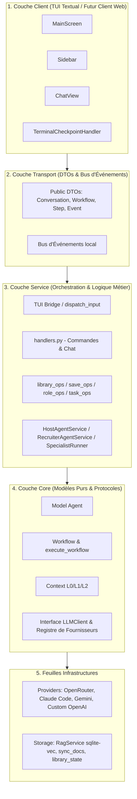

# Évaluation Approfondie de la Codebase d'Armance

Ce document présente une analyse technique détaillée et une évaluation de l'architecture de la codebase d'Armance. Conçu à l'attention des ingénieurs seniors et de l'équipe de développement, cet audit passe au crible la philosophie de conception, le respect des couches architecturales, les mécanismes d'exécution des agents, la qualité du code et la préparation pour les phases V2 (Web) et V3 (MCP/Interopérabilité).

---

## 1. Philosophie & Alignement Stratégique : « Un Cerveau, pas un Exécuteur »

Armance se distingue fondamentalement des solutions d'agents d'exécution (les *makers* type copilotes de code, générateurs automatiques de slides ou agents autonomes d'action). La codebase est conçue autour d'une contrainte d'ingénierie forte : **optimiser le jugement et la délibération, plutôt que le débit d'exécution**.

Cette philosophie se traduit par des choix de conception rigoureux :
*   **Absence d'effets de bord autonomes** (Invariant #5) : Le système ne réalise aucune action externe non supervisée (pas d'envoi d'e-mails, pas de commits Git). Il produit des livrables et des rapports d'audit dans `.armance/exports/` et laisse l'utilisateur valider l'exécution.
*   **Métaphore de la Firme de Conseil** : La spécialisation extrême des rôles (Armance pour le cadrage, Malik pour le recrutement, Kim pour l'orchestration, Mona pour la synthèse et Serge pour la contradiction) permet de découper la complexité en contrats de prompts isolés et facilement testables.
*   **La contradiction érigée en fonctionnalité** : L'existence de Serge (`system-challenger.md`) garantit qu'aucun consensus mou n'est produit par défaut.

---

## 2. Analyse de l'Architecture Technique & Respect des Couches

Armance implémente un modèle d'architecture en couches strict, validé de manière automatisée en intégration continue.



### 2.1 Évaluation de la Propreté du Découpage
*   **Isolation Top-Down** : La règle d'or (`client → transport → service → core`) est parfaitement respectée. Les couches inférieures n'importent jamais d'éléments des couches supérieures. Cette invariance est vérifiée à chaque validation par `scripts/check_invariants.sh` via l'outil d'analyse des dépendances d'importation (`.importlinter`).
*   **Indirection des Fournisseurs de Modèles** : Le couplage direct entre le cœur et les clients d'API tiers a été éliminé avec succès grâce à un patron de conception de **Registre d'enregistrement à l'importation** (`core/protocols/llm.py`). Les implémentations de fournisseurs dans `providers/` s'enregistrent dynamiquement auprès de la fabrique abstraite, empêchant toute violation d'importation circulaire ou descendante.
*   **Abstractions Prêtes pour le Web (V2)** : Le fait de passer par le protocole abstrait `CheckpointHandler` avec des types d'interactions sérialisables (`kind: text | select | confirm`) garantit que le moteur peut suspendre l'exécution et attendre une approbation humaine aussi bien sur une interface en ligne de commande (TUI) que sur des interfaces Web via WebSocket sans modifier le code métier.

---

## 3. Gestion de l'État : La Force du « Tout-Fichier »

Respectant l'Invariant #1, la codebase d'Armance n'utilise aucune base de données relationnelle lourde ou serveur externe pour stocker l'état primaire. **Le système de fichiers Markdown/YAML est l'unique source de vérité.**

```
.armance/
├── config.yaml          # Configuration générale de l'environnement (sans secrets)
├── .env                 # Clés API et jetons secrets (exclus de Git)
├── agents/              # Définitions Markdown + Frontmatter des agents
├── context/             # Niveaux de contexte L0 (Projet), L1 (Rôle) et L2 (Thème)
├── docs/                # Documents de référence fournis par l'utilisateur
├── sessions/            # Fichiers JSON d'historique de conversation et TokenLedger
└── vector/              # Index SQLite-Vec local (purement utilitaire)
```

### 3.1 La Séparation Cruciale « Indexé » vs « Chargé en Mémoire »
Une des plus belles réussites architecturales de la gestion documentaire d'Armance est la distinction nette entre ces deux états, évitant la pollution systématique des fenêtres de contexte des LLM :

| État Documentaire | Rôle Technique | Consommation de Jetons | Mode de Requêtage |
|---|---|---|---|
| **Indexed (Indexé)** | Découpé en feuillets (*slips*) et vectorisé dans `sqlite-vec`. | Uniquement lors des appels ciblés (Top-K) via la recherche sémantique. | À la demande, réinjecté localement dans la section RAG du prompt. |
| **Read / Loaded (Chargé)** | Le texte intégral du document est directement injecté dans le prompt système de tous les agents. | Élevée, consomme de la fenêtre de contexte de manière persistante ou par session. | Automatique sur chaque tour de parole de l'agent. |

### 3.2 Immutabilité des Exécutions de Workflow
Chaque exécution de workflow (`/workflow run`) génère un dossier versionné et daté (`exports/<wf>/run-<ts>/`) contenant :
*   Les fichiers `step-*.md` d'exécution unitaire.
*   La synthèse finale validée `synthesis.md`.
*   Le manifeste d'état `manifest.json`.

Cette immutabilité rend la comparaison de runs (`/workflow compare`) triviale et permet un audit complet d'une délibération passée par de simples outils de comparaison de fichiers standard (ex. `git diff` ou diff de textes).

---

## 4. Pipeline d'Exécution : Résilience & Sécurité des Rôles

Le cycle d'exécution d'un tour de parole d'agent est entièrement piloté par des événements et sécurisé par un bac à sable restrictif.

```
[Saisie Utilisateur] 
       │
       ▼
[TUI Bridge Dispatch] ──(Détection d'Intention NL / Reroutage)──► [Changement Agent]
       │
       ▼
[HostAgent / SpecialistRunner]
       │  - Assemblage Prompt Système (Caveman + RAG + L0/L1/L2 + Voice)
       │  - Appel API LLM
       ▼
[Scrubbing / Bac à Sable]
       │  - Suppression des balises <tool_call> hallucinées
       │  - Troncature des répétitions infinies (boucles de LLM)
       │  - Filtrage des tags [EXECUTE:/...] non autorisés pour le rôle
       ▼
[Exécution des Commandes Validées] (ex. /save, /recruit, /library-index)
       │
       ▼
[Affichage TUI & Mise à jour de l'État]
```

### 4.1 Sécurisation des Rôles (Agent Sandbox)
La classe `service/agent_sandbox.py` implémente un contrôle d'accès strict. Les agents ne peuvent pas exécuter arbitrairement des commandes système. Par exemple :
*   Seule **Armance** peut indexer/charger des documents de la bibliothèque (`/library-index`, `/library-load`).
*   Seul **Malik** peut recruter ou licencier des agents spécialistes (`/recruit`, `/dismiss-all`).
*   Les **spécialistes** n'ont aucun droit d'exécution en dehors du chargement de données de runs passés (`/load-run`).
Toute balise suspecte injectée par un modèle défaillant ou malveillant est automatiquement nettoyée par la méthode `scrub_reply`.

### 4.2 Robustesse face aux Modèles Faibles (Caveman Protocols)
Le mécanisme des protocoles *Caveman* (`protocols/caveman_*.txt`) applique des couches d'instructions restrictives (ex. suppression du bavardage inutile, format de réponse ultra-court) en fonction du niveau requis par l'agent. Cela permet à Armance de fonctionner de manière très stable avec des modèles gratuits ou légers (ex. modèles `:free` d'OpenRouter ou Gemini 2.0 Flash Lite) en réduisant drastiquement les hallucinations de format.

---

## 5. Qualité du Code & Rigueur d'Ingénierie

La codebase d'Armance brille par sa propreté et son respect des meilleures pratiques modernes en Python :

*   **Typage Statique Strict** : L'utilisation généralisée de Pydantic V2 pour la validation des configurations (`Config`, `ProviderConfig`) et des entités métier (`Agent`, `Task`, `Workflow`) élimine de nombreuses erreurs d'exécution silencieuses.
*   **Absence de Dépendances Lourdes d'Abstractions** : Armance a fait le choix courageux et payant de ne pas dépendre de frameworks d'agents usines à gaz comme LangChain ou LlamaIndex. Les appels aux fournisseurs d'API se font via des clients HTTP directs et légers (`httpx`), ce qui évite la « taxe d'abstraction » et garantit un contrôle total sur les prompts envoyés.
*   **Qualité Lint & CI** :
    *   Le code est intégralement formaté et analysé sous **Ruff Strict** (zéro diagnostic en attente).
    *   La suite de tests unitaires et d'intégration compte **près de 900 tests**, s'exécute en moins de 15 secondes hors ligne grâce à une mockisation propre du réseau via `respx`.
    *   Un script de validation des invariants (`scripts/check_invariants.sh`) s'assure qu'aucune violation de dépendances entre couches ou reste de code mort ne s'introduit dans le tronc commun.

---

## 6. Analyse des Axes d'Améliorations Majeurs (Feuille de Route)

Bien que la codebase soit d'une excellente tenue après la grande phase de nettoyage B1-B3 (qui a permis d'éliminer la duplication du moteur de workflow et de supprimer plus de 4 000 lignes de code mort), plusieurs opportunités méritent une attention particulière :

### 6.1 Finalisation de la Découpe de `handlers.py`
Le fichier `src/armance/service/handlers.py` a été allégé de 1724 à environ 1100 lignes en déportant les commandes de bibliothèque, de sauvegarde, de rôles et de tâches dans des modules dédiés (`service/*_ops.py`). La seconde phase de découpage peut être menée pour en extraire les trois coquilles de chat de coordination (Armance, Malik, Kim).
> **Recommandation** : Bien que ces coquilles de chat soient fortement couplées à l'injection de RAG et à la sélection de profils d'agents, isoler le pipeline de décision de Kim (conception de workflow) dans un fichier `service/orchestrator_ops.py` simplifierait la maintenance à long terme.

### 6.2 Redondance des prompts face aux fenêtres de contexte limitées
Kim, Mona et Serge possèdent encore des invites système légèrement verbeuses (environ 130 lignes). Bien que ce volume ait été réduit, l'application d'une cure de réduction de prompt plus stricte (Phase E) optimisera la vitesse d'inférence sur des modèles légers.

### 6.3 Automatisation de la découverte du modèle d'embedding (Phase P2.b)
Lors d'un premier démarrage (`armance init`), l'utilisateur doit configurer manuellement son modèle et fournisseur d'embeddings pour le RAG. La mise en place de la découverte automatique (inquantifiable par rapport au coût/bénéfice, mais hautement appréciable pour l'expérience utilisateur) permettra de déduire intelligemment le modèle idéal selon le budget de l'utilisateur.

---

## 7. Préparation aux Évolutions Futures

### 7.1 Portabilité vers le Web (Phase V2)
Le choix d'architecturer l'application avec un bus d'événements interne découplé (`transport/local.py`) et d'utiliser des objets DTO purs (`transport/dto.py`) signifie que la transition vers un backend de type FastAPI pour exposer l'application sur le Web se fera de manière fluide et transparente.
*   Le serveur Web pourra directement consommer la classe `LoopContext` et dériver un `WebCheckpointHandler` asynchrone qui redirige les requêtes de confirmation humaine vers des appels HTTP ou des connexions Websocket.
*   Zéro réécriture de la logique d'agent ou du cœur de traitement n'est requise.

### 7.2 Intégration du Model Context Protocol (MCP) (Phase V3)
La nature hautement modulaire d'Armance s'aligne idéalement avec le standard MCP développé par Anthropic.
*   Il sera aisé d'exposer les compétences métier d'Armance (indexation de bibliothèque, recrutement de panel d'experts, génération de synthèses structurées) sous forme d'outils (Tools MCP) consommables par des clients d'agents externes (comme Claude Code, Cline ou Roo Code).
*   Armance passera ainsi du statut de « CLI locale autonome » à celui de « service de conseil décentralisé interopérable ».

---

## Conclusion

La codebase d'Armance est un modèle de rigueur d'ingénierie logicielle appliquée au domaine de l'intelligence artificielle agentique. L'adhérence absolue aux invariants du projet, le refus d'introduire des dépendances de frameworks lourds inutiles et l'approche pragmatique du « tout-fichier » font de ce projet une fondation extraordinairement robuste, évolutive et prête pour l'échelle industrielle en réseau (V2 Web & V3 MCP).
